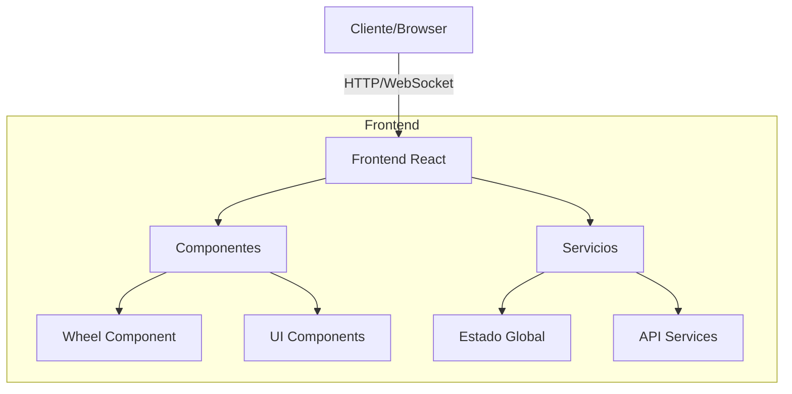
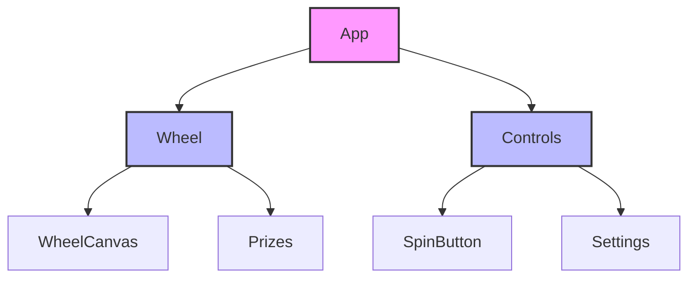
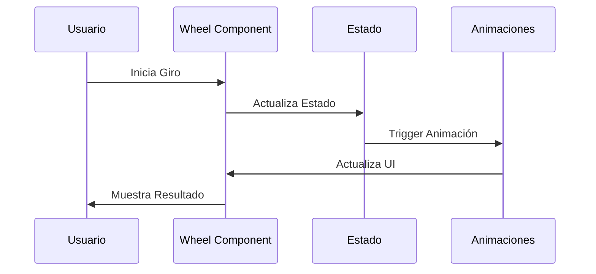

# Arquitectura de Ruleta Todo Gratis 🏗️

## Visión General del Sistema



## Estructura de Componentes



## Flujo de Datos



## Componentes Principales

### 1. Wheel Component
- Manejo de la lógica de giro
- Renderizado de la ruleta
- Gestión de animaciones
- Cálculo de premios

### 2. Estado Global
- Configuración de premios
- Estado actual del juego
- Historial de resultados
- Preferencias de usuario

### 3. Servicios
- Animaciones
- Cálculos matemáticos
- Gestión de eventos
- Almacenamiento local

## Patrones de Diseño

### 1. Component Pattern
```typescript
// Ejemplo de componente tipado
interface WheelProps {
  prizes: Prize[];
  onSpin: (prize: Prize) => void;
  isSpinning: boolean;
}

const Wheel: React.FC<WheelProps> = ({
  prizes,
  onSpin,
  isSpinning
}) => {
  // Implementación
};
```

### 2. Custom Hooks
```typescript
// Ejemplo de hook personalizado
const useWheel = (config: WheelConfig) => {
  const [isSpinning, setSpinning] = useState(false);
  const [currentPrize, setPrize] = useState<Prize | null>(null);

  // Lógica del hook
  
  return {
    isSpinning,
    currentPrize,
    spin: () => void
  };
};
```

## Consideraciones de Rendimiento

1. **Optimizaciones de React**
   - Uso de `useMemo` para cálculos costosos
   - `useCallback` para funciones estables
   - `React.memo` para prevenir re-renders

2. **Animaciones**
   - Uso de `requestAnimationFrame`
   - CSS transforms para mejor performance
   - Lazy loading de assets

3. **Estado**
   - Normalización de datos
   - Memoización de selectores
   - Actualizaciones por lotes

## Escalabilidad

### 1. Nuevas Características
- Sistema de temas
- Múltiples tipos de ruleta
- Sistemas de recompensa
- Integración con APIs externas

### 2. Performance
- Code splitting
- Lazy loading
- Caché de assets
- Service Workers

### 3. Mantenibilidad
- TypeScript strict mode
- Tests exhaustivos
- Documentación inline
- Estándares de código
