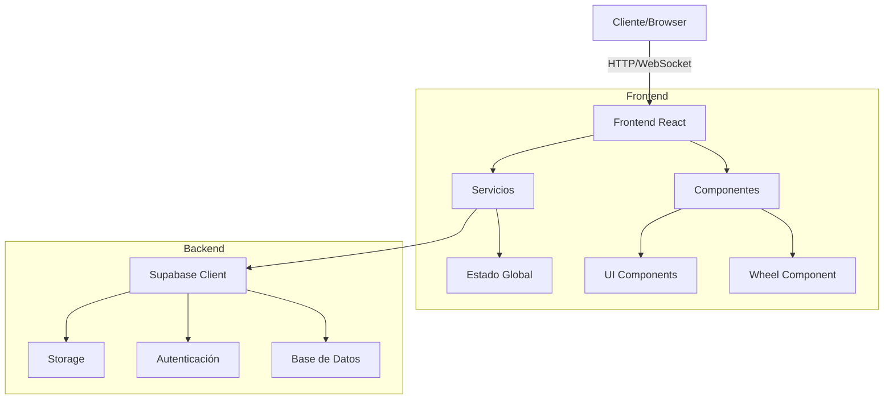
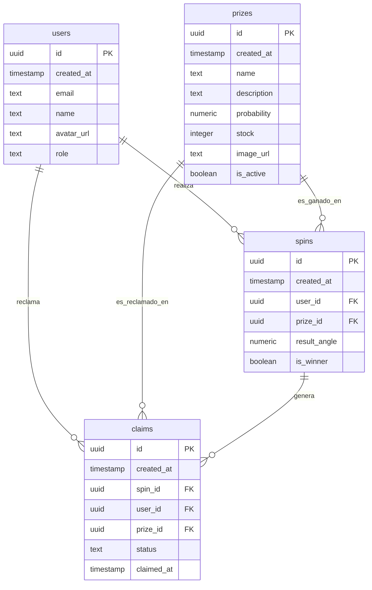
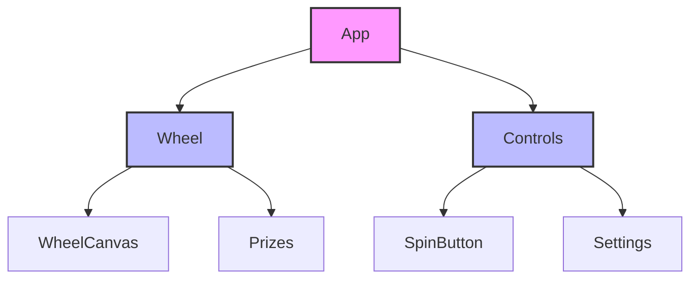
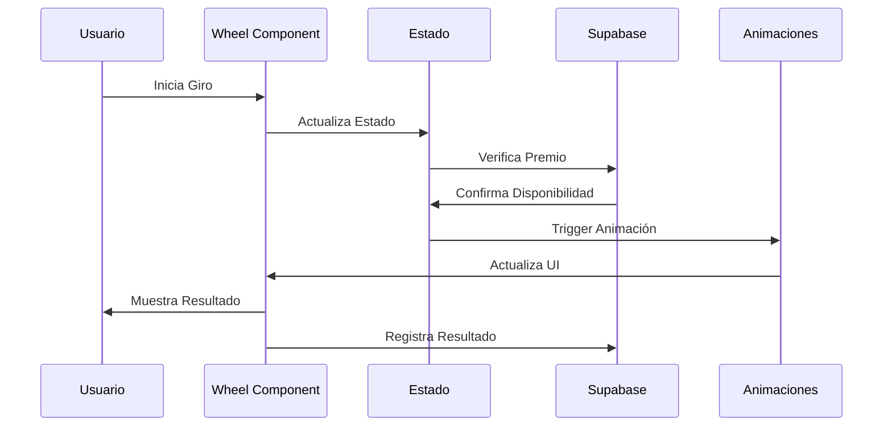

# Arquitectura de Ruleta Todo Gratis 🏗️

## Visión General del Sistema



## Estructura de Base de Datos



## Estructura de Componentes



## Flujo de Datos



## Componentes Principales

### 1. Wheel Component

- Manejo de la lógica de giro
- Renderizado de la ruleta
- Gestión de animaciones
- Cálculo de premios

### 2. Estado Global

- Configuración de premios
- Estado actual del juego
- Historial de resultados
- Preferencias de usuario

### 3. Servicios

- Supabase Client
  - Autenticación de usuarios
  - Gestión de premios
  - Registro de giros
  - Gestión de reclamaciones
- Animaciones
- Cálculos matemáticos
- Analytics y métricas

## Seguridad y Permisos

### 1. Row Level Security (RLS)

- Políticas por tabla
- Separación de roles (user/admin)
- Validación de propiedad
- Protección de datos sensibles

### 2. Autenticación

- JWT Tokens
- Roles de usuario
- Sesiones seguras
- Refresh tokens

## Analytics y Métricas

### 1. Métricas Principales

- Total de giros
- Premios ganados y reclamados
- Tiempo promedio de reclamo
- Distribución de premios
- Datos de series temporales

### 2. Engagement de Usuarios

- Usuarios activos (diarios/semanales/mensuales)
- Tasa de retorno
- Puntuación de engagement
- Horarios populares

### 3. Rendimiento

- Tiempos de carga
- Tasa de error
- Tasa de éxito
- Predicciones y tendencias

### 4. Reportes

- Formatos: PDF, XLSX, CSV
- Tipos: General, Premios, Usuarios, Rendimiento
- Filtros personalizables
- Análisis predictivo

## Patrones de Diseño

### 1. Component Pattern

```typescript
// Ejemplo de componente tipado
interface WheelProps {
  prizes: Prize[];
  onSpin: (prize: Prize) => void;
  isSpinning: boolean;
}

const Wheel: React.FC<WheelProps> = ({ prizes, onSpin, isSpinning }) => {
  // Implementación
};
```

### 2. Service Pattern

```typescript
class PrizeService {
  async getActivePrizes() {
    const { data, error } = await supabase
      .from("prizes")
      .select("*")
      .eq("is_active", true);

    if (error) throw error;
    return data;
  }
}
```

### 3. Custom Hooks

```typescript
// Ejemplo de hook personalizado
const useWheel = (config: WheelConfig) => {
  const [isSpinning, setSpinning] = useState(false);
  const [currentPrize, setPrize] = useState<Prize | null>(null);

  // Lógica del hook

  return {
    isSpinning,
    currentPrize,
    spin: () => void
  };
};
```

## Consideraciones de Rendimiento

1. **Optimizaciones de React**

   - Uso de `useMemo` para cálculos costosos
   - `useCallback` para funciones estables
   - `React.memo` para prevenir re-renders

2. **Optimizaciones de Base de Datos**

   - Índices estratégicos
   - Políticas RLS eficientes
   - Caché de consultas frecuentes

3. **Animaciones**

   - Uso de `requestAnimationFrame`
   - CSS transforms para mejor performance
   - Lazy loading de assets

4. **Estado**

   - Normalización de datos
   - Memoización de selectores
   - Actualizaciones por lotes

## Escalabilidad

### 1. Nuevas Características

- Sistema de temas
- Múltiples tipos de ruleta
- Sistemas de recompensa
- Integración con APIs externas

### 2. Performance

- Code splitting
- Lazy loading
- Caché de assets
- Service Workers

### 3. Base de Datos

- Particionamiento de tablas
- Replicación de datos
- Backups automáticos
- Migración de datos

### 4. Mantenibilidad

- TypeScript strict mode
- Tests exhaustivos
- Documentación inline
- Estándares de código
