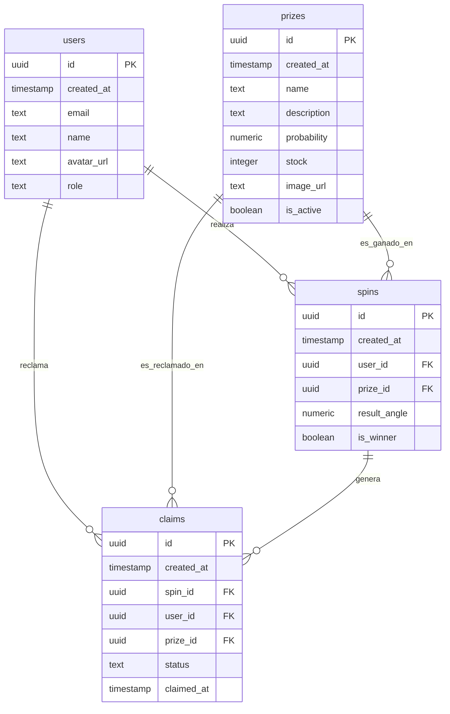

# Estructura de Base de Datos 🗄️

## Diagrama de Entidad-Relación



## Políticas de Seguridad (RLS)

### Users

| Política                         | Operación | Descripción                                         |
| -------------------------------- | --------- | --------------------------------------------------- |
| Users can view their own profile | SELECT    | Usuario puede ver su propio perfil                  |
| Admins can manage all profiles   | ALL       | Administradores pueden gestionar todos los perfiles |

### Prizes

| Política                      | Operación | Descripción                              |
| ----------------------------- | --------- | ---------------------------------------- |
| Anyone can view active prizes | SELECT    | Cualquiera puede ver premios activos     |
| Admins can manage prizes      | ALL       | Administradores pueden gestionar premios |

### Spins

| Política                         | Operación | Descripción                                |
| -------------------------------- | --------- | ------------------------------------------ |
| Users can view their own spins   | SELECT    | Usuario puede ver sus propios giros        |
| Users can create their own spins | INSERT    | Usuario puede crear sus propios giros      |
| Admins can view all spins        | SELECT    | Administradores pueden ver todos los giros |

### Claims

| Política                                | Operación | Descripción                                              |
| --------------------------------------- | --------- | -------------------------------------------------------- |
| Users can view their own claims         | SELECT    | Usuario puede ver sus propias reclamaciones              |
| Users can create claims for their spins | INSERT    | Usuario puede crear reclamaciones para sus giros         |
| Users can update their pending claims   | UPDATE    | Usuario puede actualizar sus reclamaciones pendientes    |
| Admins can manage all claims            | ALL       | Administradores pueden gestionar todas las reclamaciones |

## Funciones y Triggers

### decrement_prize_stock

```sql
-- Función para decrementar el stock de premios de manera segura
function decrement_prize_stock(prize_id UUID) returns boolean
```

### check_prize_availability

```sql
-- Trigger que verifica disponibilidad antes de un giro
trigger check_prize_before_spin
  before insert on spins
  for each row
  execute function check_prize_availability()
```

## Datos Iniciales

### Usuario Administrador

- Email: admin@example.com
- Role: admin

### Premios Iniciales

1. TV 50" 4K (5% probabilidad, stock: 1)
2. Smartphone (10% probabilidad, stock: 2)
3. Auriculares Bluetooth (15% probabilidad, stock: 5)
4. Vale de Descuento (30% probabilidad, stock: 20)
5. Puntos Extra (40% probabilidad, stock: 50)

## Índices de Optimización

- idx_spins_user_id
- idx_spins_prize_id
- idx_claims_user_id
- idx_claims_spin_id
- idx_claims_prize_id
- idx_claims_status
