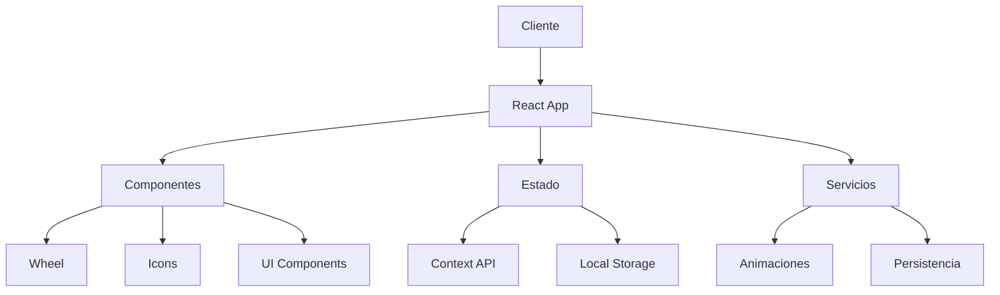
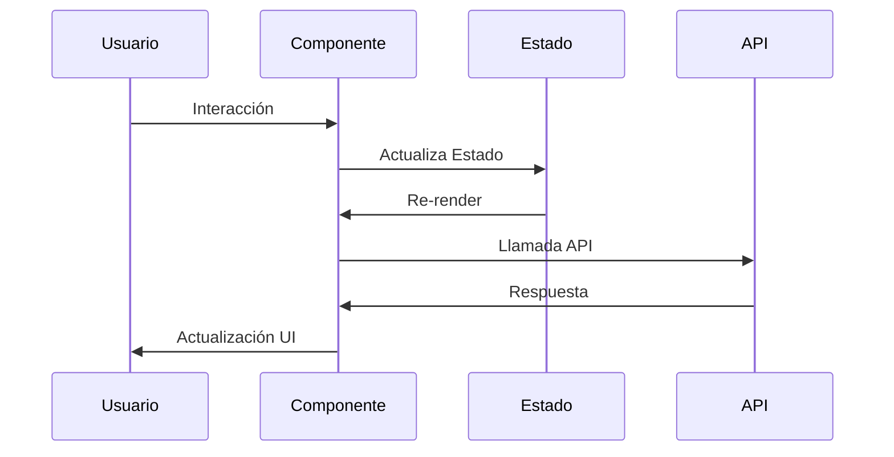

# Documentación Técnica 

## Arquitectura del Sistema



## Stack Tecnológico

### Frontend
- React 18.2.0
- TypeScript
- Vite
- Styled Components
- Canvas Confetti

### Testing
- Jest
- React Testing Library
- Vitest

### Build & Deploy
- Vite
- GitHub Actions
- Vercel/Netlify

## Estructura del Proyecto

```bash
ruleta-new/
├── src/
│   ├── components/      # Componentes React
│   │   ├── Wheel.jsx   # Componente principal de la ruleta
│   │   └── Icons.jsx   # Biblioteca de iconos SVG
│   ├── styles/         # Estilos CSS
│   ├── contexts/       # Contextos de React
│   ├── hooks/          # Custom hooks
│   ├── services/       # Servicios y utilidades
│   └── __tests__/      # Tests
├── docs/               # Documentación
│   ├── components/     # Docs de componentes
│   └── styles/         # Docs de estilos
├── public/            # Assets estáticos
└── ...
```

## Patrones y Principios

### 1. Component Pattern
- Componentes modulares
- Props tipadas
- Separación de responsabilidades

### 2. Custom Hooks
- Lógica reutilizable
- Estado compartido
- Efectos secundarios

### 3. Context API
- Estado global
- Temas
- Configuración

## Flujo de Datos



## Performance

### 1. Optimizaciones
- Code splitting
- Lazy loading
- Memoización

### 2. Métricas Clave
- First Paint: < 1s
- TTI: < 2s
- Bundle size: < 100kb

### 3. Monitoreo
- Lighthouse
- Web Vitals
- Error tracking

## Seguridad

### 1. Frontend
- Sanitización de inputs
- CSP
- HTTPS

### 2. Estado
- Validación de datos
- Encriptación local
- Manejo de sesión

## Testing

### 1. Unitarios
```javascript
describe('Component', () => {
  it('should render', () => {
    // Implementation
  });
});
```

### 2. Integración
```javascript
describe('Feature', () => {
  it('should work end-to-end', () => {
    // Implementation
  });
});
```

## CI/CD

### GitHub Actions
```yaml
name: CI
on: [push, pull_request]
jobs:
  test:
    runs-on: ubuntu-latest
    steps:
      - uses: actions/checkout@v2
      - name: Test
        run: npm test
```

## Versionado

### Semantic Versioning
- Major: Cambios breaking
- Minor: Nuevas features
- Patch: Bug fixes

## Mantenimiento

### 1. Logs
- Error tracking
- Performance monitoring
- User analytics

### 2. Backups
- Estado local
- Configuración
- Assets

## Roadmap Técnico

### Fase 1: MVP
- [x] Componente Wheel
- [x] Animaciones básicas
- [x] Premios configurables

### Fase 2: Mejoras
- [ ] TypeScript migration
- [ ] Test coverage
- [ ] Performance optimization

### Fase 3: Escalado
- [ ] PWA support
- [ ] Offline mode
- [ ] Analytics

## Guías de Desarrollo

### 1. Código
- ESLint config
- Prettier
- TypeScript strict

### 2. Git
- Conventional commits
- Branch strategy
- PR template

### 3. Documentación
- JSDoc
- README
- Changelog

## Troubleshooting

### Problemas Comunes

1. **Build Failures**
   - Verificar dependencias
   - Limpiar cache
   - Revisar logs

2. **Performance Issues**
   - Profiling
   - Bundle analysis
   - Memory leaks

3. **State Management**
   - Redux DevTools
   - React DevTools
   - Logger middleware

## Referencias

- [React Docs](https://reactjs.org/docs)
- [TypeScript Handbook](https://www.typescriptlang.org/docs)
- [Testing Library](https://testing-library.com/docs)
- [Vite Guide](https://vitejs.dev/guide)

## Arquitectura

La aplicación sigue una arquitectura de capas clara y modular:

```
Frontend
├── Components (Presentación)
├── Services (Lógica de Negocio)
├── API (Comunicación Backend)
└── Utils (Helpers)
```

### Componentes
Los componentes siguen el patrón de presentación/contenedor y están construidos de manera modular.

### Servicios
Manejan la lógica de negocio y el estado de la aplicación.

### API
Gestiona todas las comunicaciones con el backend.

## Flujo de Datos

1. Usuario interactúa con componente
2. Componente llama a servicio
3. Servicio verifica caché
4. Si no hay caché, servicio llama a API
5. API comunica con backend
6. Respuesta fluye en sentido inverso

## Sistema de Caché

### Implementación
```typescript
const CACHE_KEY = 'prizes_cache';
const CACHE_DURATION = 5 * 60 * 1000; // 5 minutos

interface CacheEntry<T> {
  data: T;
  timestamp: number;
}

class CacheService {
  get<T>(key: string): T | null {
    const entry = storage.get<CacheEntry<T>>(key);
    if (!entry) return null;
    
    if (this.isExpired(entry.timestamp)) {
      this.remove(key);
      return null;
    }
    
    return entry.data;
  }
  
  set<T>(key: string, data: T): void {
    storage.set(key, {
      data,
      timestamp: Date.now()
    });
  }
  
  private isExpired(timestamp: number): boolean {
    return Date.now() - timestamp > CACHE_DURATION;
  }
}
```

## Manejo de Errores

### Frontend
- Toast notifications para errores de usuario
- Logging detallado para debugging
- Reintentos automáticos para operaciones fallidas

### API
- Tipos de error específicos
- Manejo de timeouts
- Reintentos con backoff exponencial

## Testing

### Componentes
```typescript
// Ejemplo de test de componente
describe('PrizesList', () => {
  it('maneja estados de carga');
  it('muestra errores apropiadamente');
  it('permite reclamar premios');
});
```

### Servicios
```typescript
// Ejemplo de test de servicio
describe('PrizeService', () => {
  it('gestiona caché correctamente');
  it('maneja errores de API');
  it('actualiza estado después de reclamar');
});
```

## Optimización de Rendimiento

### Estrategias Implementadas
1. Sistema de caché
2. Lazy loading de componentes
3. Memoización de cálculos costosos
4. Compresión de assets
5. Code splitting

### Métricas Objetivo
- First Paint: < 1s
- Time to Interactive: < 2s
- Performance Score: > 90

## Seguridad

### Frontend
- Sanitización de inputs
- Validación de datos
- Protección XSS
- CSRF tokens

### API
- Rate limiting
- Validación de tokens
- Sanitización de respuestas

## Integración Continua

### Pipeline
1. Lint
2. Type Check
3. Unit Tests
4. Integration Tests
5. Build
6. Deploy

### Scripts
```bash
# Lint
npm run lint

# Test
npm run test

# Build
npm run build
```

## Convenciones de Código

### Nombrado
- Componentes: PascalCase
- Funciones: camelCase
- Constantes: UPPER_SNAKE_CASE

### Estructura de Archivos
```
components/
  ├── ComponentName/
  │   ├── index.tsx
  │   ├── styles.css
  │   └── __tests__/
  │       └── ComponentName.test.tsx
  └── ...
```

## Dependencias Principales

- React 18.2.0
- TypeScript 4.9.5
- Vite 4.3.9
- Axios 1.4.0
- Testing Library 14.0.0

## Variables de Entorno

```env
VITE_API_URL=http://localhost:3000/api
VITE_CACHE_DURATION=300000
VITE_ENABLE_MOCK_API=false
```

## Comandos Útiles

```bash
# Desarrollo
npm run dev

# Tests
npm run test
npm run test:watch
npm run test:coverage

# Build
npm run build
npm run preview

# Lint
npm run lint
npm run lint:fix
```

## Troubleshooting

### Problemas Comunes
1. Caché desactualizada
   - Solución: Limpiar localStorage
2. Error de CORS
   - Solución: Verificar configuración de API
3. Tests fallando
   - Solución: Actualizar snapshots

## Recursos

- [Documentación de Componentes](./components/)
- [Guía de Estilos](./styles/)
- [API Reference](./api/)
