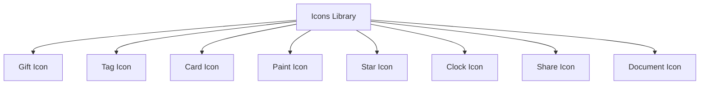

# Componente Icons 🎨

## Descripción
El componente Icons es una colección de iconos SVG utilizados en toda la aplicación, especialmente en la ruleta de premios.

## Catálogo de Iconos



## Implementación

### Estructura Base
```jsx
export const Icons = {
  IconName: () => (
    <svg xmlns="http://www.w3.org/2000/svg" viewBox="0 0 24 24" fill="currentColor">
      <path d="..." />
    </svg>
  )
}
```

## Iconos Disponibles

### 1. Gift Icon
```jsx
<Icons.Gift />
```
- **Uso**: Representa premios y regalos
- **ViewBox**: 0 0 24 24
- **Path**: Regalo con lazo

### 2. Tag Icon
```jsx
<Icons.Tag />
```
- **Uso**: Representa descuentos y ofertas
- **ViewBox**: 0 0 24 24
- **Path**: Etiqueta con círculo

### 3. Card Icon
```jsx
<Icons.Card />
```
- **Uso**: Representa bonos y tarjetas de regalo
- **ViewBox**: 0 0 24 24
- **Path**: Tarjeta con banda

### 4. Paint Icon
```jsx
<Icons.Paint />
```
- **Uso**: Representa kits de pintura
- **ViewBox**: 0 0 24 24
- **Path**: Brocha de pintura

### 5. Star Icon
```jsx
<Icons.Star />
```
- **Uso**: Representa premios especiales
- **ViewBox**: 0 0 24 24
- **Path**: Estrella rellena

## Uso

### Importación
```jsx
import { Icons } from './components/Icons';
```

### Implementación Básica
```jsx
function MyComponent() {
  return (
    <div>
      <Icons.Gift className="icon" />
    </div>
  );
}
```

### Con Estilos
```jsx
<Icons.Gift 
  style={{ 
    width: '24px',
    height: '24px',
    color: 'currentColor'
  }} 
/>
```

## Personalización

### 1. Tamaño
Los iconos son escalables y pueden ajustarse mediante CSS:
```css
.icon {
  width: 24px;
  height: 24px;
}
```

### 2. Color
Los iconos usan `currentColor` y heredan el color del texto padre:
```css
.icon-container {
  color: #FF6B6B;
}
```

### 3. Animaciones
```css
.icon {
  transition: transform 0.3s ease;
}

.icon:hover {
  transform: scale(1.1);
}
```

## Mejores Prácticas

1. **Accesibilidad**
   ```jsx
   <Icons.Gift aria-label="Regalo" role="img" />
   ```

2. **Optimización**
   - SVGs optimizados
   - Paths simplificados
   - ViewBox consistente

3. **Mantenibilidad**
   - Nombres descriptivos
   - Documentación inline
   - Estructura modular

## Testing

```javascript
describe('Icons Component', () => {
  it('should render Gift icon', () => {
    const { container } = render(<Icons.Gift />);
    expect(container.querySelector('svg')).toBeInTheDocument();
  });

  it('should apply custom className', () => {
    const { container } = render(<Icons.Gift className="custom-class" />);
    expect(container.firstChild).toHaveClass('custom-class');
  });
});
```

## Extensión

Para agregar un nuevo icono:

1. **Crear el SVG**
```jsx
NewIcon: () => (
  <svg xmlns="http://www.w3.org/2000/svg" viewBox="0 0 24 24" fill="currentColor">
    <path d="..." />
  </svg>
)
```

2. **Agregar al objeto Icons**
```jsx
export const Icons = {
  existing: ...,
  NewIcon: () => (...)
}
```

3. **Documentar**
- Agregar al catálogo
- Describir uso
- Actualizar tests

## Troubleshooting

### Problemas Comunes

1. **Icono no visible**
   - Verificar importación
   - Comprobar tamaño
   - Validar color heredado

2. **Tamaño incorrecto**
   - Revisar CSS
   - Verificar ViewBox
   - Comprobar contenedor

3. **Color no cambia**
   - Verificar currentColor
   - Comprobar herencia
   - Revisar fill/stroke
