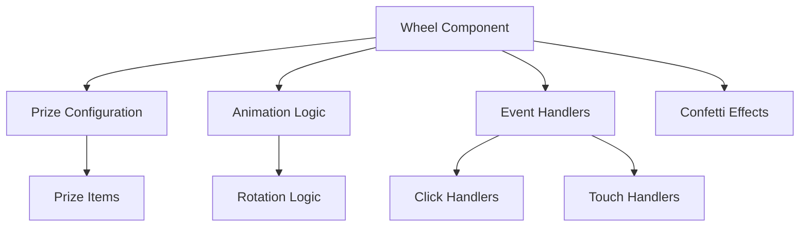

# Componente Wheel 🎡

## Descripción
El componente Wheel es el componente principal de la aplicación, responsable de renderizar y manejar la lógica de la ruleta interactiva.

## Estructura



## Props

```typescript
interface Prize {
  name: string;
  description: string;
  icon: React.ReactNode;
  color: string;
}

interface WheelProps {
  initialRotation?: number;  // Rotación inicial de la ruleta
  spinDuration?: number;     // Duración de la animación de giro
  onSpinComplete?: (prize: Prize) => void;  // Callback cuando termina el giro
}
```

## Estado Interno

```typescript
interface WheelState {
  isSpinning: boolean;      // Estado de giro actual
  rotation: number;         // Rotación actual
  selectedPrize: Prize | null;  // Premio seleccionado
  spinCount: number;        // Contador de giros
}
```

## Funcionalidades Principales

### 1. Configuración de Premios
- 8 premios diferentes
- Cada premio tiene:
  - Nombre
  - Descripción
  - Ícono personalizado
  - Color de fondo

### 2. Animación de Giro
- Animación suave usando CSS transforms
- Duración configurable
- Efecto de desaceleración natural
- Compatibilidad con dispositivos táctiles

### 3. Efectos Visuales
- Confetti al ganar
- Transiciones suaves
- Feedback visual durante la interacción

## Estilos

Los estilos del componente están definidos en `Wheel.css`:

### Estructura CSS
```css
.wheel-container {
  /* Contenedor principal */
}

.wheel {
  /* Ruleta */
  transform-origin: center;
  transition: transform var(--spin-duration) cubic-bezier(0.1, 0.7, 0.1, 1);
}

.prize-section {
  /* Secciones de premios */
  transform-origin: center;
}

.prize-content {
  /* Contenido de cada premio */
}
```

## Uso

```jsx
import Wheel from '../components/Wheel';

function App() {
  const handleSpinComplete = (prize) => {
    console.log(`¡Felicitaciones! Ganaste: ${prize.name}`);
  };

  return (
    <Wheel
      spinDuration={5000}
      onSpinComplete={handleSpinComplete}
    />
  );
}
```

## Mejores Prácticas

1. **Performance**
   - Uso de `transform` para animaciones suaves
   - Evitar re-renders innecesarios
   - Optimización de assets

2. **Accesibilidad**
   - Soporte para teclado
   - ARIA labels
   - Mensajes de estado

3. **Responsive**
   - Adaptable a diferentes tamaños de pantalla
   - Soporte para dispositivos táctiles
   - Orientación flexible

## Testing

```javascript
describe('Wheel Component', () => {
  it('should render all prizes', () => {
    // Test implementation
  });

  it('should spin when clicked', () => {
    // Test implementation
  });

  it('should trigger confetti on win', () => {
    // Test implementation
  });
});
```

## Mantenimiento

### Agregar Nuevos Premios
1. Añadir el premio al array `prizes`
2. Asignar un ícono único
3. Elegir un color distintivo
4. Actualizar la documentación

### Modificar Animaciones
1. Ajustar variables CSS
2. Actualizar duración en props
3. Modificar curva de animación

## Troubleshooting

### Problemas Comunes

1. **La ruleta no gira**
   - Verificar que CSS está cargado
   - Comprobar eventos de click
   - Revisar consola de errores

2. **Animación entrecortada**
   - Usar `transform` en lugar de propiedades que causan reflow
   - Verificar performance del dispositivo
   - Optimizar otras animaciones

3. **Premios no visibles**
   - Verificar estructura HTML
   - Comprobar estilos CSS
   - Validar datos de premios

## Próximas Mejoras

1. **Funcionalidades**
   - Probabilidades personalizadas por premio
   - Animaciones personalizables
   - Modo oscuro

2. **Técnicas**
   - Migración a TypeScript
   - Tests E2E
   - Mejor manejo de errores

3. **UX/UI**
   - Más efectos visuales
   - Sonidos
   - Temas personalizables
