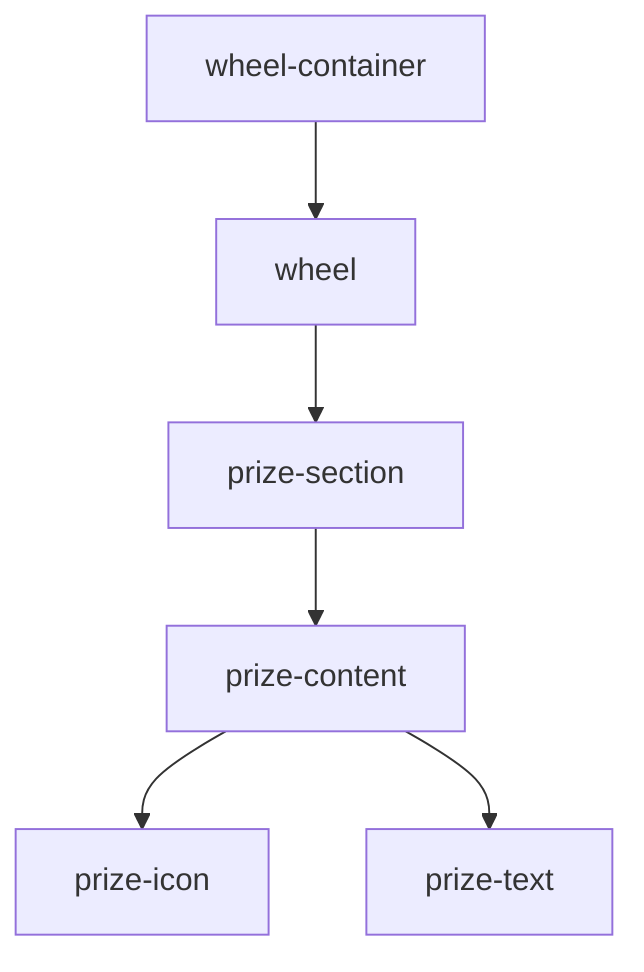

# Estilos del Componente Wheel 🎨

## Estructura Visual



## Variables CSS

```css
:root {
  --wheel-size: 500px;
  --wheel-slice-spacing: 50px;
  --wheel-border-size: 5px;
  --wheel-color: #da3768;
  --neutral-color: white;
  --PI: 3.14159265358979;
  --nb-item: 8;
  --item-nb: 0;
  --selected-item: 0;
  --nb-turn: 5;
  --spinning-duration: 4s;
  --reset-duration: 0.25s;
}
```

## Componentes Principales

### 1. Contenedor Principal
```css
.wheel-container {
  display: flex;
  justify-content: center;
  align-items: center;
  position: relative;
  width: var(--wheel-size);
  height: var(--wheel-size);
}
```

### 2. Ruleta
```css
.wheel {
  width: 100%;
  height: 100%;
  border-radius: 50%;
  border: var(--wheel-border-size) solid var(--wheel-color);
  position: relative;
  transition: transform var(--spinning-duration) cubic-bezier(0.1, 0.7, 0.1, 1);
}
```

### 3. Secciones de Premios
```css
.prize-section {
  position: absolute;
  width: 50%;
  height: 50%;
  transform-origin: 100% 100%;
  transform: rotate(calc(var(--item-nb) * (360deg / var(--nb-item))));
  clip-path: polygon(0 0, 100% 0, 100% 100%);
}
```

## Animaciones

### 1. Giro de la Ruleta
```css
@keyframes spin {
  from {
    transform: rotate(0deg);
  }
  to {
    transform: rotate(var(--nb-turn) * 360deg);
  }
}
```

### 2. Transiciones
```css
.wheel {
  transition: transform var(--spinning-duration) cubic-bezier(0.1, 0.7, 0.1, 1);
}

.prize-content {
  transition: transform 0.3s ease-in-out;
}
```

## Responsive Design

### Mobile
```css
@media (max-width: 768px) {
  :root {
    --wheel-size: 350px;
    --wheel-slice-spacing: 35px;
  }

  .prize-text {
    font-size: 14px;
  }
}
```

### Tablet
```css
@media (min-width: 769px) and (max-width: 1024px) {
  :root {
    --wheel-size: 400px;
    --wheel-slice-spacing: 40px;
  }
}
```

## Temas

### Claro (Default)
```css
:root {
  --wheel-color: #da3768;
  --neutral-color: white;
  --text-color: #333;
}
```

### Oscuro
```css
[data-theme="dark"] {
  --wheel-color: #ff4081;
  --neutral-color: #333;
  --text-color: white;
}
```

## Mejores Prácticas

1. **Performance**
   - Uso de `transform` para animaciones
   - Minimizar repaints
   - Optimizar selectores CSS

2. **Mantenibilidad**
   - Variables CSS reutilizables
   - Nomenclatura BEM
   - Comentarios descriptivos

3. **Accesibilidad**
   - Contraste adecuado
   - Estados focusables
   - Textos legibles

## Personalización

### 1. Colores
```css
.prize-section:nth-child(1) { --prize-color: #FF6B6B; }
.prize-section:nth-child(2) { --prize-color: #4ECDC4; }
/* ... */
```

### 2. Tamaños
```css
:root {
  --wheel-size: 500px;
  --icon-size: 24px;
  --text-size: 16px;
}
```

### 3. Animaciones
```css
:root {
  --spin-duration: 4s;
  --transition-timing: cubic-bezier(0.1, 0.7, 0.1, 1);
}
```

## Troubleshooting

### Problemas Comunes

1. **Desalineación de Secciones**
   - Verificar ángulos de rotación
   - Comprobar transform-origin
   - Validar clip-path

2. **Animaciones Entrecortadas**
   - Usar propiedades GPU-accelerated
   - Simplificar transiciones
   - Reducir complejidad visual

3. **Responsive Issues**
   - Ajustar variables CSS
   - Usar unidades relativas
   - Testear en múltiples dispositivos
